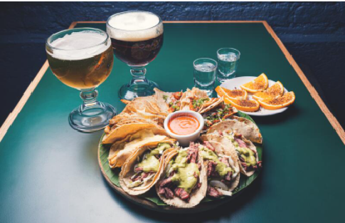

# Carnitas en Olla de Presión

 

## Ingredientes

  
|  Ingrediente | Cantidades |
| ------------ | ------------ |
| Carne de cerdo |  1 Kg con poca grasa y sin hueso (espaldilla, lomo alto, tapilla, etc.) |
| Manteca de cerdo  |  1 cucharada (yo pongo aceite de girasol) |
| Dientes de ajo  | 3 |
| Zumo de naranja  | 1/2 taza |
| Leche evaporada (Ideal)  | 1/2 taza |
| Sal y pimienta  | Al gusto |
| Salsas  | Para acompañar |
  

  

## Video para antojar

  

## PROCESO
1. Cortamos la carne en trozos regulares y ponemos a freír en la olla con la cucharada de manteca y los dientes de ajo.
  
  
2. Cuando la carne esté bien sellada, vaciamos zumo de naranja, leche evaporada y pimienta al gusto (no añadimos agua). Cerramos la olla y ponemos a cocer a fuego medio hasta que esté suave, entre 25 a 30 min.
 
  
3. Abrimos la olla, salamos al gusto y ponemos a hervir a fuego fuerte por otros 15 o 20 min. o hasta que se evaporen los líquidos y la carne dore sin quemarse.  Añadimos sal. Cuidamos para que no quede muy reseca.
   
  
  
Con la cuchara se deshebra fácilmente la carne.
  

  
4. Se sirve con tortillas de maíz, frijoles refritos, salsas y guacamole.
  
  
## SUGERENCIA DEL CHEF
  
  Se recomienda degustar con unas ricas y frias cervezas.
  
  

    **Integrantes**

[TOCM]

[TOC]

#Karla
#Edgar
