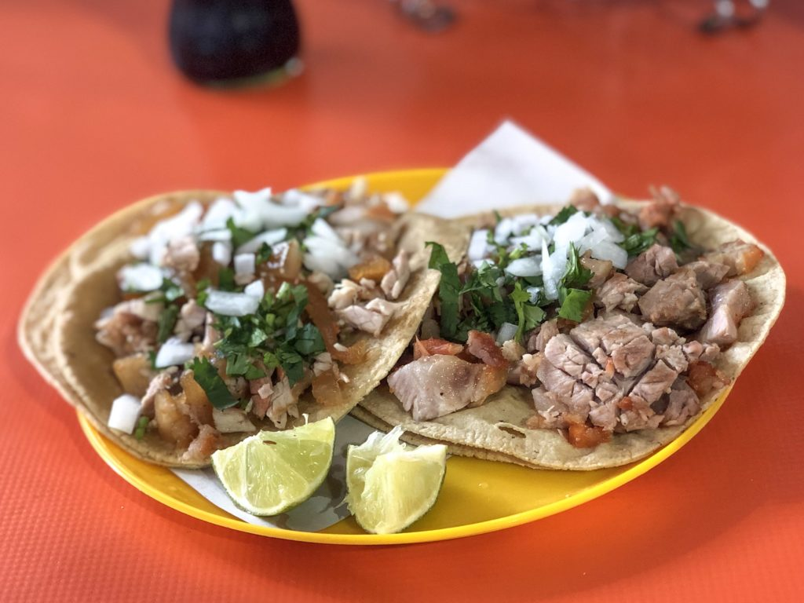

# Carnitas en Olla de Presión

 

## Ingredientes

  
|  Ingrediente | Cantidades |
| ------------ | ------------ |
| Carne de cerdo |  1 Kg con poca grasa y sin hueso (espaldilla, lomo alto, tapilla, etc.) |
| Manteca de cerdo  |  1 cucharada (yo pongo aceite de girasol) |
| Dientes de ajo  | 3 |
| Zumo de naranja  | 1/2 taza |
| Leche evaporada (Ideal)  | 1/2 taza |
| Sal y pimienta  | Al gusto |
| Salsas  | Para acompañar |
  

  

## Video para antojar

  

## PROCESO
1. Cortamos la carne en trozos regulares y ponemos a freír en la olla con la cucharada de manteca y los dientes de ajo.
  
## SUGERENCIA DEL CHEF
  
  Se recomienda degustar con unas ricas y frias cervezas.
  
  
